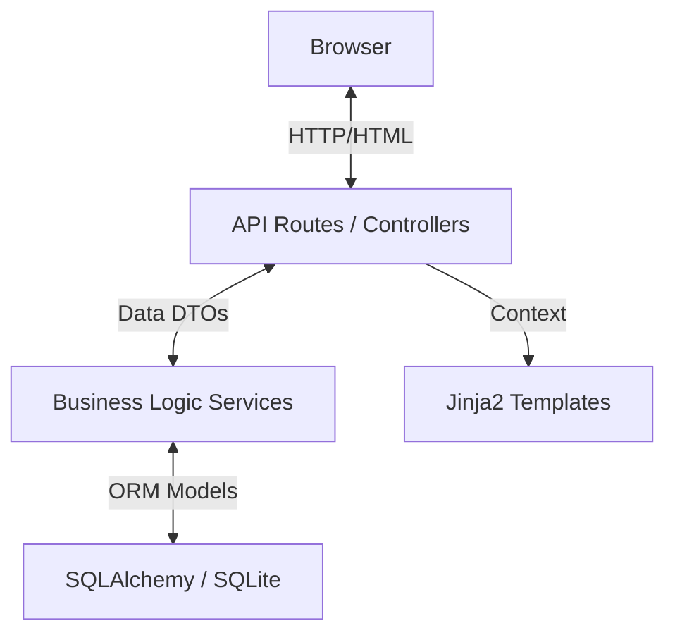

# Expense Manager - Implementation & Design Documentation

## 1. System Overview
Expense Manager is a web-based personal finance application designed to help users track their income, expenses, account balances, and budgets. The system is built with a focus on simplicity, performance, and data privacy, offering a self-hosted solution that runs locally.

## 2. Technology Stack & Rationale

### Backend: FastAPI (Python 3.12)
- **Why:** FastAPI was chosen for its high performance (Starlette-based), easy-to-use dependency injection system, and automatic data validation (Pydantic).
- **Benefit:** Allows rapid development of robust API endpoints with built-in type safety.

### Database: SQLAlchemy (ORM)
- **Why:** Provides a powerful abstraction layer over SQL, allowing dev-prod flexibility (SQLite for dev, PostgreSQL for prod).
- **Benefit:** Strong schema enforcement and relationship management.

### Frontend: Server-Side Rendering (SSR) with Jinja2
- **Why:** Simple architecture without the complexity of a separate SPA (Single Page Application) build step. SEO-friendly and fast initial page loads.
- **Benefit:** Reduces "Javascript fatigue" and allows passing backend context directly to views.

### Styling: Tailwind CSS
- **Why:** Utility-first CSS framework enabling rapid UI development without writing custom CSS files.
- **Benefit:** Consistent design system and easy responsiveness.

### Visualization: Chart.js
- **Why:** Lightweight, canvas-based charting library.
- **Benefit:** Interactive and responsive financial charts with minimal overhead.

## 3. Architecture Design

The application follows a **Service-Repository-Controller** (or Service-Route) pattern to separate concerns.

### Directory Structure Design
- **`app/routes/`**: Handles HTTP requests, input validation, and rendering templates. Clean separation by domain (auth, accounts, transactions).
- **`app/services/`**: Contains pure business logic (e.g., calculating net worth, updating balances). independent of HTTP context.
- **`app/models.py`**: Defines the database schema.
- **`app/templates/`**: HTML files with Jinja2 syntax.

## 4. Key Design Decisions

### A. Authentication System
**Decision:** Use Session-based Authentication with Server-Side Cookies.
- **Reasoning:** Since we are using SSR, session cookies are more secure and easier to manage than JWTs which require client-side storage handling.
- **Security:**
    - `bcrypt` is used for password hashing (slow hashing to prevent brute force).
    - `HttpOnly` cookies prevent XSS attacks from stealing sessions.
    - Mandatory password change on first login.

### B. Transaction Logic & Data Integrity
**Decision:** transactional integrity managed via Service Layer.
- **Problem:** A "Transfer" transaction affects two accounts (Source down, Dest up). A CC payment affects Bank (down) and CC (debt down).
- **Solution:** `TransactionService` handles these atomic operations.
    - If a transaction is updated/deleted, the *reverse* logic is applied first to restore original balances, then the new logic is applied.
    - This ensures `current_balance` on accounts is always accurate without summing up all transaction history every time (Balance Snapshot approach).

### C. Account Types Modeling
**Decision:** Single `Account` table with an `Enum` type.
- **Reasoning:** Bank Accounts, Credit Cards, and Cash wallets share 80% of fields (name, balance/limit).
- **Polymorphism:** Specific fields (`due_date` for CC, `account_number` for Bank) are nullable columns in the same table. This simplifies queries like "Get all accounts" for the Net Worth calculation.

### D. Budgeting Strategy
**Decision:** Month-based budgeting per Category.
- **Logic:** Users set a limit for a specific `(category_id, month, year)`.
- **Visualization:** The system calculates `sum(expense transactions)` for that category/month and compares against the budget limit.

## 5. Database Schema

### `users`
- Authentication and profile data.
- **Key Fields:** `user_id` (username), `password_hash`, `role` (admin/user).

### `accounts`
- Stores financial holding places.
- **Key Fields:** `current_balance`, `type` (bank/cash/credit_card), `used_amount` (for CC).

### `categories`
- Classification for transactions.
- **Design:** `is_system` flag prevents deletion of core categories (e.g., 'Salary', 'Housing').

### `transactions`
- The core ledger.
- **Relationships:**
    - `source_account_id`: Where money leaves.
    - `dest_account_id`: Where money enters (for transfers).
    - `category_id`: What it was for.
- **Design:** `receipt_path` stores string path to local file system.

## 6. Security Features

1.  **Role-Based Access Control (RBAC):**
    - Middleware checks `user.role` before allowing access to Admin routes.
    - Standard users cannot access `/admin` or modify other users' data (Tenant isolation by `user_id` in queries).

2.  **File Upload Security:**
    - Filenames are randomized using `uuid` to prevent directory traversal or overwriting.
    - Uploads stored outside the web root (served via specific mount).

3.  **Data Isolation:**
    - Every database query filters by `user_id`. A user can never see another user's transactions, even if they guess the ID.

## 7. Scalability & Future Considerations

- **Database:** The `DATABASE_URL` env var allows seamless switching to PostgreSQL for high-concurrency production environments.
- **Async:** FastAPI is async-native. Heavy operations (like export generation) can be offloaded to background tasks easily.
- **Frontend migration:** The API-first design (even though currently used by Jinja) allows easily attaching a React/Vue frontend later if needed, as the data logic is decoupled in Services.
